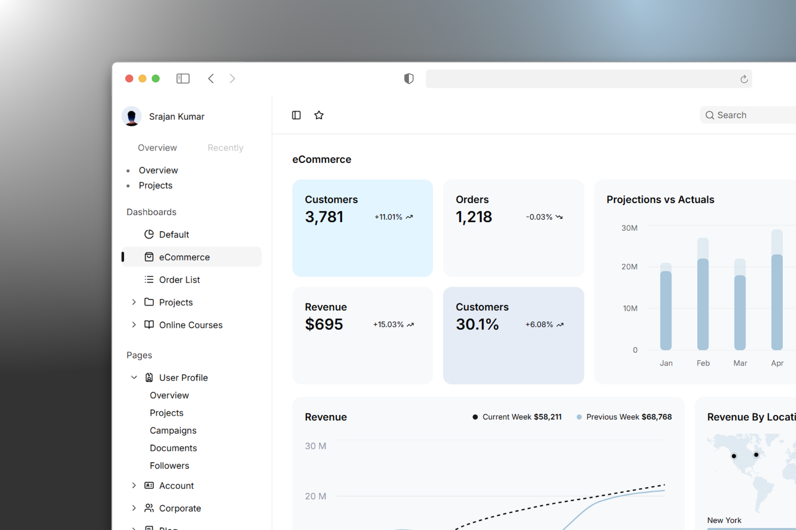

# Juspay Assignment

This project is an implementation of the provided **SaaS Dashboard designs**. It focuses on high-quality UI fidelity, smooth motion, and meaningful microinteractions for an enhanced user experience.

In this project, I used [Next.js](https://github.com/vercel/next.js) for the frontend and [Shadcn UI](https://github.com/shadcn-ui/ui) for the user interface components, and deployed the application using [Vercel](https://github.com/vercel/vercel).

## Live Demo

You can check out the live version of the web app here:  
[Deployment Preview](https://srajan-juspay.vercel.app)

## Source Code

The source code for the project is available in this GitHub repository:  
[Source Code - GitHub](https://github.com/srajankumar/juspay-assignment)

## Mockups

<div align="center">
  
</div>
<div align="center">
  
</div>

## Installation

To run this project locally, follow these steps:

1. Clone the repository:

   ```bash
   git clone https://github.com/srajankumar/juspay-assignment.git
   ```

2. Navigate to the project directory:

   ```bash
   cd juspay-assignment
   ```

3. Install the dependencies:

   ```bash
   npm install
   ```

4. Start the development server:

   ```bash
   npm run dev
   ```

5. Open your browser and visit `http://localhost:3000` to view the app.

## Contact

Feel free to reach out if you have any questions or feedback on my project - [https://srajan.vercel.app](https://srajan.vercel.app)

> _Thank you for taking the time to review my assignment. I look forward to hearing back from you soon :)_
