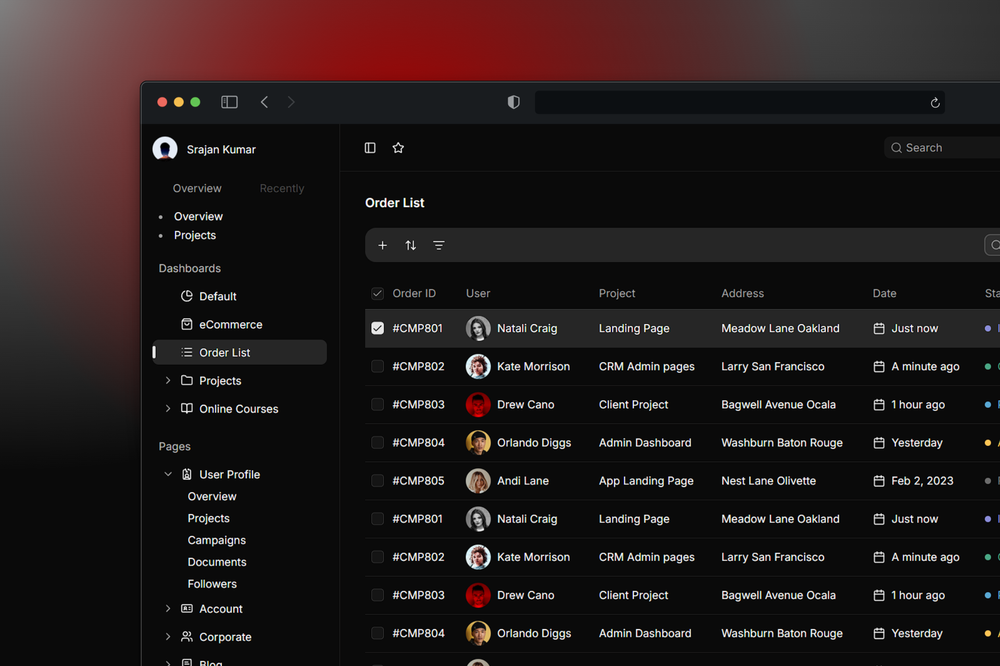

# Juspay Assignment

A pixel-perfect SaaS Dashboard built with [React](https://react.dev) / [Next.js](https://github.com/vercel/next.js), replicating the given Figma design.

This project focuses on UI precision, microinteractions, motion design, and code quality, ensuring responsiveness and accessibility across devices.

## Features Implemented

- Pixel-Perfect UI matching Figma
- Light / Dark Mode toggle
- Hover Effects for charts
- Responsive Layouts for Desktop, Tablet, and Mobile
- Search, Filter, Sort, Pagination

## Deployment

GitHub Repository Link – [Click Here](https://github.com/srajankumar/juspay-assignment)  
Deployed Link – [Click Here](https://srajan-juspay.vercel.app)  
Video Recording Link – [Click Here](https://drive.google.com/drive/u/1/folders/1hoB3bqkJvtAMm3cLMqZXM-O4zXxtIkdP)

## Implemented Pages

### `/dashboard/e-commerce`

- Dashboard showing key sales and revenue metrics.
- Features interactive charts, animated cards, and custom tooltips for better insights.

### `/dashboard/order-list`

- Interactive order table with sorting, filtering, and pagination.

## Challenges Faced

- Maintaining pixel-perfect spacing across screen sizes.
- Optimizing animations for smooth frame rates on low-end devices.
- Ensuring responsive layouts matched Figma’s design breakpoints.

## Mockups

<div align="center">
  
</div>
<div align="center">
  
</div>

## Installation

To run this project locally, follow these steps:

1. Clone the repository:

   ```bash
   git clone https://github.com/srajankumar/juspay-assignment.git
   ```

2. Navigate to the project directory:

   ```bash
   cd juspay-assignment
   ```

3. Install the dependencies:

   ```bash
   npm install
   ```

4. Start the development server:

   ```bash
   npm run dev
   ```

5. Open your browser and visit `http://localhost:3000` to view the app.

## Contact

Feel free to reach out if you have any questions or feedback - [https://srajan.vercel.app](https://srajan.vercel.app)

> _Thank you for taking the time to review my assignment. I look forward to hearing back from you soon :)_
